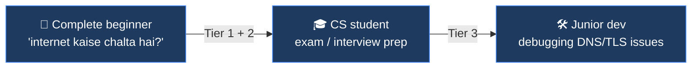
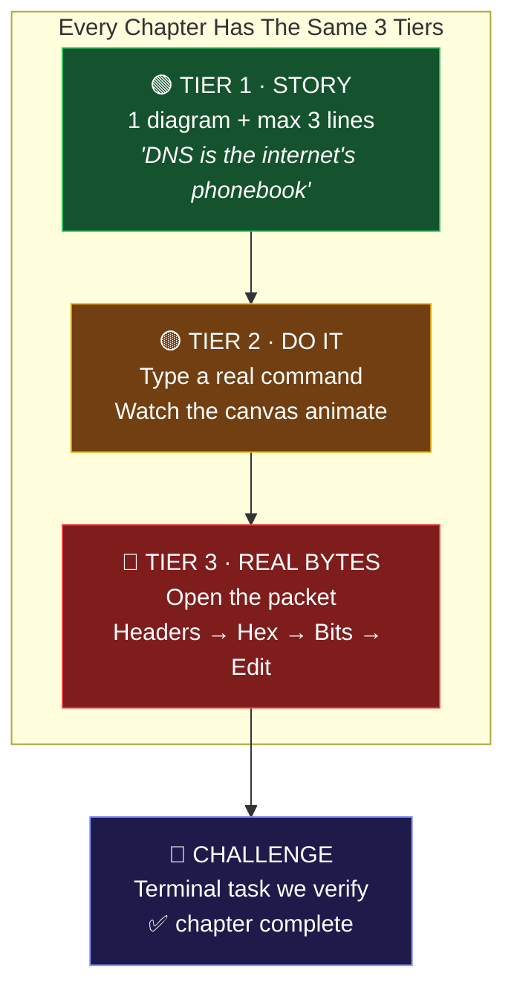
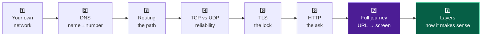

# 00 · Overview — What we are building and why

---

## 🩹 The Problem

```
Student:  "Bhai, DNS kya hai?"
Internet: [ 40-page PDF ]  [ 2-hour lecture ]  [ OSI 7 layers on slide 1 ]
Student:  *closes tab*
```

Three things break networking education:

| Broken thing | Why it kills learning |
|---|---|
| 🧱 **It's invisible** | Packets are real, but nobody ever *sees* one. You memorise, you don't understand. |
| 📚 **Theory first** | Books start with OSI 7 layers — abstract names for things you've never met. |
| 🎁 **Libraries hide it** | `fetch()` does DNS + TCP + TLS + HTTP in one line. You never learn what happened. |

**Our problem statement:**

> **Beginners cannot learn networking because they never see it happen.
> We make the network visible, touchable, and breakable.**

---

## 👤 Target User



**Primary:** the beginner who wants to *understand*, not memorise.
**Secondary:** the CS student who needs real header-level detail for exams/interviews.

They are the **same person at different zoom levels** — that's the design insight.

---

## 💎 The USP

> ### Real packets you can open, edit, break, and re-send.

Not an animation. Not a simulation of a packet. **The actual bytes that just left your machine.**

```
┌─ Why this cannot be faked ────────────────────────────────┐
│                                                            │
│  User changes byte 0x03  from  0x01 (QTYPE=A)             │
│                          to    0x1c (QTYPE=AAAA)          │
│                                                            │
│  Presses [re-send]                                         │
│                                                            │
│  → Real UDP packet leaves the machine                      │
│  → Real DNS server at 8.8.8.8 answers                      │
│  → An IPv6 address comes back instead of IPv4              │
│                                                            │
│  A judge instantly knows this is real.                     │
│  A scripted animation can never do this.                   │
└────────────────────────────────────────────────────────────┘
```

---

## 🧩 The 3-Tier Lesson Engine

**One engine. Eight configs.** This is the entire reason 8 chapters is feasible solo in 72h.



- **Beginner** stops after Tier 2. Fully satisfied.
- **Student** goes to Tier 3. Fully served.
- **Nobody** is overwhelmed, because Tier 3 is collapsed by default.

---

## 📚 The 8 Chapters (the arc)



**🎯 The innovation:** OSI layers are **Chapter 8, not Chapter 1.**
Every course on earth starts with 7 abstract layers. We teach the *pieces* first, then reveal that
they were layers all along. That "ohhh" moment is our 10% Innovation score.

**Real vs Sim:**

| Ch | Topic | Data source |
|:--:|---|---|
| 1 | Your own network | 🟢 **REAL** — your actual IP, gateway, ARP table |
| 2 | DNS | 🟢 **REAL** — our own DNS client over `node:dgram` |
| 3 | Routing | 🟢 **REAL** — real `traceroute` hops + your real routing table |
| 4 | TCP vs UDP | 🟠 **SIM** — loss/reorder slider (labelled as simulation) |
| 5 | TLS | 🟢 **REAL** — our own ClientHello, real cert parsed by us |
| 6 | HTTP | 🟢 **REAL** — our own request bytes, our own response parser |
| 7 | Full journey | 🟢 **REAL** — all of the above, chained |
| 8 | Layers | 🟠 **SIM view of REAL data** — wrap/unwrap a real captured packet |

> 6 of 8 chapters run on **real network traffic**. That's the whole ballgame.

---

## 🖥️ The built-in Terminal

The terminal is **not** a gimmick bolted on the side. It is the *input device* for the whole app.

```
 Type a command  ──▶  Real network operation  ──▶  Canvas animates it live
                                              └──▶  Inspector fills with real bytes
```

| Command | Backed by | Real? |
|---|---|---|
| `dig <domain>` | our raw DNS codec + `node:dgram` | 🟢 |
| `ping <host>` | system `ping`, output parsed by us | 🟢 |
| `tracert <host>` | system traceroute, hops animated live | 🟢 |
| `curl <url>` | our handwritten HTTP/1.1 over `node:tls` | 🟢 |
| `tls <host>` | our handwritten ClientHello + cert parser | 🟢 |
| `ifconfig` | `ipconfig`/`ifconfig` parsed by us | 🟢 |
| `route` | your real routing table | 🟢 |
| `arp` | your real ARP cache | 🟢 |
| `netstat` | your real open connections | 🟢 |
| `sim loss 30%` | our simulation engine | 🟠 |
| `help` · `clear` · `ls` | built-in | — |

---

## ❌ What we are NOT building (final — do not reopen)

| Dropped | Why |
|---|---|
| 🌍 World → country → city → building zoom map | 100% effort, 0% learning. Pure decoration. |
| ⚡ Bit-level electrical signals / Layer 1 physics | Boring, unteachable, no payoff. |
| 🖧 Full virtual network builder (drag routers, VLANs, switches) | A whole product on its own. |
| 🔐 Complete TLS 1.3 handshake (key exchange, AEAD, transcript hash) | Eats 72h alone. We do the *educational probe* + `node:tls` for real data. |
| 📦 Raw packet sniffing (libpcap / promiscuous mode) | Needs a native dependency + admin rights. Violates the spirit and the rules. |
| 🔁 Full TCP state machine implementation | `node:net` gives us the socket; kernel owns SYN/ACK. We are honest about it. |
| 👥 Accounts, login, multiplayer, cloud sync | Not the product. `node:fs` JSON is enough. |

---

## ⚠️ Honest limitations (we put these in the README — judges reward honesty)

1. **Raw TCP headers (SYN/ACK) are not visible.** Node's `node:net` hands us a connected socket; the kernel does the handshake. We show what *is* observable: connect RTT, local/remote ports, socket state — and we say so.
2. **`ping`/`traceroute` shell out to the OS tool** via `node:child_process` (standard library). We parse the output ourselves — no npm wrapper. ICMP raw sockets are not available in Node's stdlib.
3. **TLS: we build and send a real ClientHello and parse the real ServerHello + certificate chain**, then hand off to `node:tls` for the encrypted data transfer. We do not implement the key schedule.
4. **Chapter 4 (packet loss/reorder) is a simulation** and is labelled `SIM` in the UI.

---

## 📊 How this maps to the judging rubric

| Criterion | Weight | Our play |
|---|:--:|---|
| **Functionality & Usefulness** | 35% | A complete 8-chapter course + a real network toolkit. Genuinely replaces a textbook chapter. |
| **Zero-Dependency Craft** | 30% | DNS wire codec, X.509/DER parser, HTTP/1.1 parser, terminal emulator, tween engine, canvas renderer — all hand-written. |
| **Code Quality** | 25% | Layered modules, pure codecs with fixture-based tests via `node:test`, no globals, one job per file. |
| **Innovation** | 10% | Editable real packets. OSI taught last. Terminal ↔ visualizer coupling. |

---

## 🏷️ Name shortlist

| Name | Vibe | Note |
|---|---|---|
| **`netlens`** ⭐ | "libraries wrap, we unwrap" | Short, memorable, matches encapsulation theme |
| `netlens` | Inspection tool | Safe but generic |
| `wirescope` | Wireshark-adjacent | May read as a clone |
| `packetpath` | Journey theme | Fine, less punchy |

**Recommendation: `netlens`.** It literally names the Chapter 8 payoff (encapsulation/decapsulation).

---

**➡️ Next:** [01-ARCHITECTURE.md](01-ARCHITECTURE.md)
