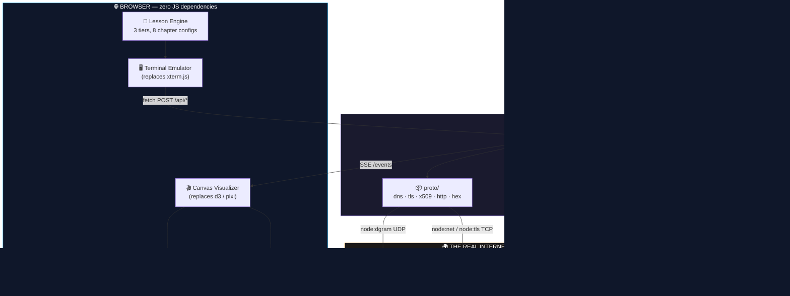
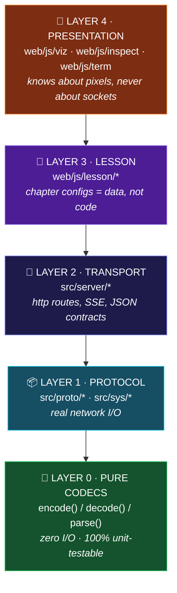
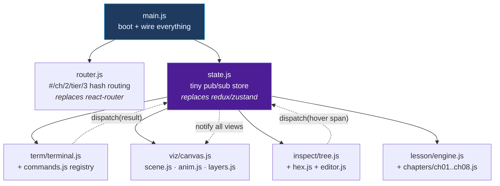
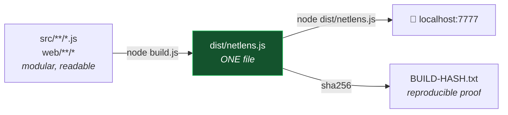
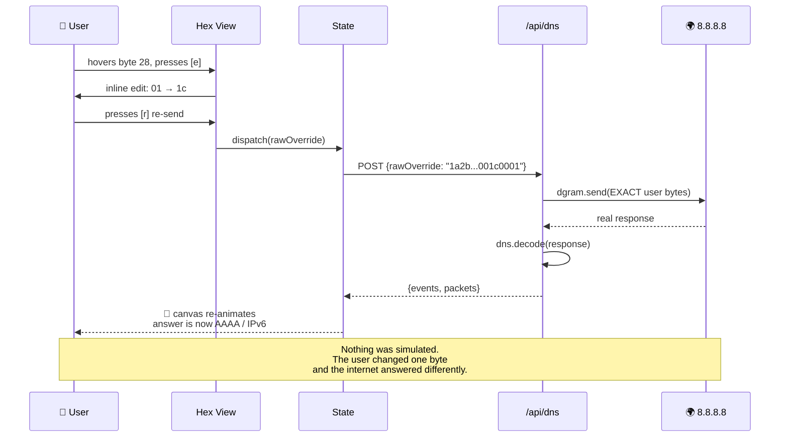

# 01 · Architecture

---

## 🏛️ 10,000-foot view



---

## 🔁 The core loop (memorise this)

```
┌──────────────────────────────────────────────────────────────────────┐
│                                                                       │
│  1. User types  $ dig github.com                    [Terminal]        │
│                          │                                            │
│  2. POST /api/dns  {domain, type, rawOverride?}     [fetch]           │
│                          │                                            │
│  3. proto/dns.js  encode() → Uint8Array(28)         [pure function]   │
│                          │                                            │
│  4. dgram.send() ────────────────▶ 8.8.8.8:53       [REAL PACKET]     │
│     dgram.on('message') ◀────────                                     │
│                          │                                            │
│  5. proto/dns.js  decode(buf) → {header, question,  [pure function]   │
│                                  answers[], _spans} │                 │
│                          │                                            │
│  6. Response JSON:                                                    │
│     { events:[…timeline…], packets:[{dir,hex,tree,spans}] }           │
│                          │                                            │
│  7. Visualizer animates the packet flying 8.8.8.8   [Canvas]          │
│     Inspector fills with header tree + hex          [DOM]             │
│     Terminal prints dig-style output                [DOM]             │
│                          │                                            │
│  8. User presses [e] on a byte → edits → [re-send]                    │
│     → back to step 2 with rawOverride                                 │
│                                                                       │
└──────────────────────────────────────────────────────────────────────┘
```

**The magic is step 5's `_spans`.** Every decoded field carries `{offset, length, bitOffset?, bitLength?}`.
That single idea powers *all four zoom levels* with no extra work:

```
Field tree  ──click "QTYPE"──▶  span {offset:26, length:2}
                                        │
              ┌─────────────────────────┼─────────────────────────┐
              ▼                         ▼                         ▼
       Hex view highlights      Bit view highlights       Canvas label
       bytes 26–27              bits 208–223              points at it
```

**One data structure → four synchronised views.** No duplication anywhere.

---

## 🧱 Layered module design



### 🔑 The single most important rule

> **Layer 0 does no I/O.**
> `dns.encode()` takes an object → returns bytes. `dns.decode()` takes bytes → returns an object.
> No sockets, no files, no `await`.

Why this matters for **Code Quality (25%)**:
- Every codec is unit-testable with **captured hex fixtures** — no network needed in CI
- Tests run in milliseconds, deterministically
- The byte editor works for free (it's just `decode(userEditedBytes)`)

---

## 🌐 API contract

All endpoints return the **same envelope**. One shape, one renderer.

```jsonc
// POST /api/dns   { "domain": "github.com", "type": "A" }
{
  "ok": true,
  "durationMs": 12.4,
  "events": [                              // → drives the TIMELINE + canvas
    { "t": 0.0,  "dir": "out", "from": "192.168.1.5", "to": "8.8.8.8:53",
      "proto": "UDP", "bytes": 28, "label": "DNS query",
      "narration": "Tumhare PC ko github.com ka IP nahi pata..." },
    { "t": 12.4, "dir": "in",  "from": "8.8.8.8:53", "to": "192.168.1.5",
      "proto": "UDP", "bytes": 44, "label": "DNS response",
      "narration": "Phonebook ne jawab bheja: 140.82.113.4" }
  ],
  "packets": [                             // → drives the INSPECTOR
    {
      "id": "p1",
      "hex": "1a2b010000010000000000000667697468756203636f6d0000010001",
      "tree": [                            // → drives the FIELD TREE
        { "name": "Header", "children": [
          { "name": "ID",      "value": "0x1a2b", "span": [0,2] },
          { "name": "QR",      "value": "0 (query)", "span": [2,1], "bits": [0,1] },
          { "name": "Opcode",  "value": "0 (QUERY)", "span": [2,1], "bits": [1,4] },
          { "name": "RD",      "value": "1", "span": [2,1], "bits": [7,1],
            "explain": "Recursion Desired — 'server, tum poora kaam karo, mujhe sirf answer do'" }
        ]},
        { "name": "Question", "children": [
          { "name": "QNAME",  "value": "github.com", "span": [12,16] },
          { "name": "QTYPE",  "value": "1 (A)",      "span": [28,2],
            "editHint": "0x001c kar do → IPv6 (AAAA) maangega" }
        ]}
      ]
    }
  ]
}
```

Every other endpoint (`/api/tls`, `/api/http`, `/api/ping`, `/api/trace`) returns **this exact shape**.
➡️ Write the renderer once. Ship 8 chapters.

---

## 📡 Endpoint map

| Method | Route | Module | Notes |
|---|---|---|---|
| `GET` | `/` , `/web/*` | `server/static.js` | Serves HTML/CSS/JS. In built mode, from memory. |
| `POST` | `/api/dns` | `proto/dns-client.js` | `rawOverride` field = the byte editor |
| `POST` | `/api/tls` | `proto/tls.js` | ClientHello probe + cert parse |
| `POST` | `/api/http` | `proto/http.js` | Handwritten request/response |
| `POST` | `/api/sys` | `sys/exec.js` | `{cmd:"ping"\|"trace"\|"route"\|"arp"\|"ifconfig"\|"netstat"}` |
| `GET` | `/events?id=` | `server/sse.js` | Live hop-by-hop stream for `traceroute` |
| `GET/POST` | `/api/progress` | `store/progress.js` | `node:fs` JSON, chapter completion |

**Security note (we build it in from hour 1):**
`sys/exec.js` uses `execFile` with a **fixed allowlist of binaries** and **regex-validated hostnames**.
No user string is ever concatenated into a shell command. This goes in the README — it's a Code Quality signal.

---

## 🎬 Why SSE (and only for traceroute)

```
dig / curl / tls      → fast (< 1s)  → plain JSON response, animate client-side  ✅ simple
traceroute            → 10–30s       → SSE stream, animate each hop as it lands  ✅ worth it
```

SSE in stdlib is ~30 lines:
```js
res.writeHead(200, { 'Content-Type': 'text/event-stream', 'Cache-Control': 'no-cache' })
res.write(`data: ${JSON.stringify(hop)}\n\n`)
```
**This replaces `socket.io` / `ws` / `eventsource`.** → Package Killer.

---

## 🎨 Client-side architecture



**One store. Every view subscribes.** ~60 lines total:

```js
// state.js — the entire "framework"
const listeners = new Set()
let state = { chapter: 1, tier: 1, packets: [], selectedSpan: null, progress: {} }
export const get = () => state
export const set = (patch) => { state = { ...state, ...patch }; listeners.forEach(f => f(state)) }
export const sub = (fn) => { listeners.add(fn); return () => listeners.delete(fn) }
```

That's the whole state management layer. **React + Redux replaced in 6 lines.** Put this in `STDLIB.md`.

---

## ⏱️ The tween engine (`viz/anim.js`)

Replaces `gsap` / `anime.js` / `framer-motion`. ~80 lines.

```js
// requestAnimationFrame loop + easing functions
const easeOutCubic = t => 1 - Math.pow(1 - t, 3)

function tween({ from, to, ms, ease = easeOutCubic, onUpdate, onDone }) { /* rAF loop */ }
```

Packet animation = tween a dot along a path between two nodes. That's it.
**No physics engine. No particle library. Just `lerp` + `rAF`.**

---

## 🎯 Canvas scene model

```
scene = {
  nodes: [ {id:'you', x, y, label:'You (192.168.1.5)', icon:'device'},
           {id:'dns', x, y, label:'8.8.8.8', icon:'server'} ],
  links: [ {from:'you', to:'dns', state:'up'|'down'|'lossy'} ],
  packets:[ {id, from, to, progress:0..1, color, size, label} ]
}
```

Chapter 3 (routing) and Chapter 4 (TCP) reuse **the exact same scene model** with more nodes.
Chapter 8 (layers) uses a different renderer (`viz/layers.js`) but the same packet data.

> **Rule: ONE generic scene engine. Chapters are data (node/link lists), not new code.**
> The moment you write a second canvas renderer, you've lost 6 hours.

---

## 🔨 Build strategy (bonus: Single File + Reproducible)



`build.js` (hand-written, ~120 lines, **replaces webpack/esbuild/rollup/vite**):
1. Topologically resolve relative `import`s in `src/`
2. Concatenate into one ESM file, rewriting imports to local scopes
3. Inline `web/index.html`, CSS and client JS as template-literal string constants
4. Emit `dist/netlens.js`
5. Print + write `sha256` → run twice, get the same hash → **Reproducible Build +5**

**Both entry points work:**
```bash
node run.js            # dev — reads from disk, edit + refresh
node dist/netlens.js    # single file — the bonus artifact
```

**Determinism checklist for reproducible builds:**
- ❌ no `Date.now()` in output · ❌ no random ids · ✅ sorted file traversal · ✅ `\n` line endings forced

---

## 🧪 Testing architecture

```
test/
├── fixtures/          real captured packets as .hex files ← the secret weapon
│   ├── dns-query-github.hex
│   ├── dns-resp-github.hex
│   ├── tls-serverhello.hex
│   └── ping-win.txt / ping-linux.txt / tracert-win.txt
├── dns.test.js        encode → hex matches fixture · decode(fixture) → expected object
├── tls.test.js        ClientHello bytes · ServerHello parse · X.509 fields
├── http.test.js       request build · chunked response parse · header folding
├── sysparse.test.js   ping/tracert/route parsers on BOTH win + linux fixtures
├── build.test.js      build twice → identical sha256 (reproducibility test!)
└── roundtrip.test.js  decode(encode(x)) === x  for every codec
```

Runner: `node --test` (stdlib, Node 18+). **No jest, no mocha, no chai.**

> **Fixture strategy:** on Day 1, run one real `dig`, dump the hex to `test/fixtures/`.
> From then on every test is offline, instant, and deterministic. No flaky network tests.

---

## 🗂️ Data flow for the Byte Editor (the demo climax)



---

**➡️ Next:** [02-FILE-STRUCTURE.md](02-FILE-STRUCTURE.md)
