# 02 · File Structure

> **Rule: one file, one job.** If a file needs the word "and" to describe it, split it.
> Target: **no file over ~250 lines.** Judges read file lists before they read code.

---

## 🌳 The full tree

```
netlens/
│
├── 📄 package.json              ← "dependencies": {}  ⭐ dependency proof #1
├── 📄 package-lock.json         ← empty tree          ⭐ dependency proof #2
├── 📄 README.md                 ← the judge's first 60 seconds
├── 📄 STDLIB.md                 ← ⭐ bonus +3 — written DAILY, not at the end
├── 📄 DEPENDENCY-PROOF.md       ← how we prove it, reproducibly
├── 📄 BUILD-HASH.txt            ← sha256 of dist/netlens.js  ⭐ bonus +5
├── 📄 .gitignore
│
├── 🚀 run.js                    ← THE ONE COMMAND:  node run.js
├── 🔨 build.js                  ← src → dist/netlens.js (replaces webpack)
├── 🛡️ verify-zero-dep.js        ← scans every import, fails on non-stdlib ⭐ proof #3
│
├── 📁 docs/                     ← you are here
│   ├── README.md · 00-OVERVIEW.md · 01-ARCHITECTURE.md
│   ├── 02-FILE-STRUCTURE.md · 03-CHAPTERS.md
│   ├── 04-72-HOUR-PLAN.md · 05-ZERO-DEP-STRATEGY.md · 06-DEMO-SCRIPT.md
│
├── 📁 src/                      ═══════════ SERVER (Node stdlib only) ═══════════
│   │
│   ├── 📁 server/
│   │   ├── server.js            create http server, wire routes, listen        ~90
│   │   ├── routes.js            route table → handler map                      ~70
│   │   ├── static.js            serve web/ (disk in dev, memory in bundle)     ~80
│   │   ├── sse.js               event-stream helper (replaces ws/socket.io)    ~40
│   │   └── respond.js           json() / error() / envelope builders           ~50
│   │
│   ├── 📁 proto/                ── LAYER 0+1 · the crown jewels ──
│   │   ├── dns.js               🧮 encode()/decode() DNS wire format  PURE     ~220
│   │   ├── dns-client.js        🔌 node:dgram send/recv + timeout              ~80
│   │   ├── tls.js               🧮 buildClientHello() / parseServerHello() PURE ~240
│   │   ├── tls-probe.js         🔌 node:net raw handshake probe                ~90
│   │   ├── x509.js              🧮 minimal ASN.1/DER cert parser  PURE         ~200
│   │   ├── http.js              🧮 buildRequest()/parseResponse() chunked PURE ~180
│   │   ├── http-client.js       🔌 node:tls / node:net fetch                   ~90
│   │   └── hexdump.js           🧮 bytes → hex rows + ascii gutter             ~50
│   │
│   ├── 📁 sys/                  ── real OS network tools ──
│   │   ├── exec.js              🛡️ execFile allowlist + arg validation         ~70
│   │   ├── ping.js              parse ping output (win/linux/mac)              ~110
│   │   ├── trace.js             parse tracert/traceroute, stream hops          ~130
│   │   └── netinfo.js           ipconfig / route / arp / netstat parsers       ~180
│   │
│   ├── 📁 sim/
│   │   └── reliability.js       Ch4 only: loss/reorder/retransmit model        ~120
│   │
│   ├── 📁 store/
│   │   └── progress.js          node:fs JSON read/write, atomic                ~60
│   │
│   └── 📁 shared/
│       ├── bytes.js             🧮 BitReader/BitWriter, hex↔bytes, spans       ~130
│       ├── narrate.js           narration string table (EN + Hinglish)         ~150
│       └── explain.js           field → 3-line explanation map                 ~200
│
├── 📁 web/                      ═══════════ CLIENT (browser APIs only) ═══════════
│   │
│   ├── index.html               single page, semantic, no framework            ~120
│   │
│   ├── 📁 css/
│   │   ├── reset.css                                                            ~40
│   │   ├── theme.css            CSS custom props, dark + light                  ~90
│   │   └── app.css              layout grid, panels, terminal, hex              ~350
│   │
│   └── 📁 js/
│       ├── main.js              boot, wire modules, first render                ~90
│       ├── state.js             🧠 6-line pub/sub store (replaces redux)        ~60
│       ├── router.js            hash routing #/ch/2/tier/3 (replaces r-router)  ~70
│       ├── api.js               fetch wrappers + SSE client                     ~80
│       ├── dom.js               el() helper (replaces jQuery/React.createElement)~50
│       │
│       ├── 📁 term/
│       │   ├── terminal.js      🖥️ input, history, cursor, output (≠ xterm.js)  ~200
│       │   ├── commands.js      command registry + dispatch                     ~180
│       │   └── autocomplete.js  tab completion + hints                          ~70
│       │
│       ├── 📁 viz/
│       │   ├── canvas.js        🎬 rAF render loop, DPI scaling                 ~120
│       │   ├── scene.js         nodes/links/packets model + hit-testing         ~160
│       │   ├── draw.js          primitives: device, server, router, cable, pkt  ~220
│       │   ├── anim.js          ⏱️ tween + easing (replaces gsap)               ~80
│       │   └── layers.js        Ch8 encapsulation wrap/unwrap renderer          ~180
│       │
│       ├── 📁 inspect/
│       │   ├── timeline.js      event list, click → select packet              ~110
│       │   ├── tree.js          collapsible field tree, span highlighting      ~140
│       │   ├── hex.js           hex grid + ascii + span highlight              ~150
│       │   ├── bits.js          bit ruler for the selected byte                ~90
│       │   └── editor.js        ✏️ byte edit + re-send  ⭐ THE CLIMAX           ~120
│       │
│       └── 📁 lesson/
│           ├── engine.js        3-tier runner, progress, next/prev             ~160
│           ├── check.js         challenge verification rules                   ~90
│           └── 📁 chapters/     ⚠️ DATA ONLY — no logic lives here
│               ├── ch01-your-network.js
│               ├── ch02-dns.js
│               ├── ch03-routing.js
│               ├── ch04-tcp-udp.js
│               ├── ch05-tls.js
│               ├── ch06-http.js
│               ├── ch07-journey.js
│               └── ch08-layers.js
│
└── 📁 test/                     ═══════════ node --test, zero deps ═══════════
    ├── 📁 fixtures/             real captured bytes — the secret weapon
    │   ├── dns-query-github.hex
    │   ├── dns-resp-github.hex
    │   ├── dns-resp-cname.hex
    │   ├── tls-clienthello.hex
    │   ├── tls-serverhello.hex
    │   ├── cert-github.der
    │   ├── http-chunked.txt
    │   ├── ping-win.txt / ping-linux.txt
    │   └── tracert-win.txt / traceroute-linux.txt
    ├── dns.test.js
    ├── tls.test.js
    ├── x509.test.js
    ├── http.test.js
    ├── sysparse.test.js
    ├── bytes.test.js
    ├── roundtrip.test.js        decode(encode(x)) === x  ∀ codecs
    └── build.test.js            ⭐ build twice → identical sha256
```

**Estimated total: ~5,200 lines of hand-written code.** Solo + AI over 72h: tight but real.

---

## 📐 The 4 zones and their hard boundaries

```mermaid
flowchart LR
    subgraph PURE["🧮 PURE (no I/O)"]
        P1["proto/dns.js"]
        P2["proto/tls.js"]
        P3["proto/x509.js"]
        P4["proto/http.js"]
        P5["shared/bytes.js"]
    end
    subgraph IO["🔌 I/O"]
        I1["*-client.js"]
        I2["sys/*"]
        I3["store/*"]
    end
    subgraph WIRE["🔌 WIRE"]
        W1["server/*"]
    end
    subgraph VIEW["🎨 VIEW"]
        V1["web/js/**"]
    end

    IO --> PURE
    WIRE --> IO
    VIEW -->|"HTTP JSON only"| WIRE

    style PURE fill:#14532d,stroke:#22c55e,color:#fff
    style IO fill:#164e63,stroke:#22d3ee,color:#fff
    style WIRE fill:#1e1b4b,stroke:#818cf8,color:#fff
    style VIEW fill:#7c2d12,stroke:#fb923c,color:#fff
```



| Boundary rule | Violation looks like | Cost |
|---|---|---|
| 🧮 Pure files never `import node:*` (except `node:buffer`) | `dns.js` calling `dgram.send()` | Tests need network → flaky → you lose a night |
| 🔌 I/O files never format for display | `ping.js` returning HTML | You'll rewrite it for the terminal AND the canvas |
| 🎨 View never knows a protocol name | `hex.js` with `if (proto === 'dns')` | 8 chapters → 8 special cases → spaghetti |
| 📖 Chapter files contain **zero logic** | `ch03.js` with a `function` in it | Chapter 4 copy-pastes it → 8 divergent copies |

---

## 🧬 Anatomy of a chapter file (data only!)

```js
// web/js/lesson/chapters/ch02-dns.js
export default {
  id: 2,
  slug: 'dns',
  title: 'Names → Numbers',
  subtitle: 'How "github.com" becomes 140.82.113.4',
  icon: '📖',

  tier1: {                                    // 🟢 STORY — max 3 lines. Enforced.
    lines: [
      'Computers do not know names. They only know numbers (IP addresses).',
      'DNS is the internet\'s phonebook: you give a name, it gives a number.',
      'Your PC asks a DNS server. Right now. Let\'s watch it happen.'
    ],
    scene: 'you -> resolver',                 // preset from viz/scene.js
    diagram: 'dns-basic'
  },

  tier2: {                                    // 🟡 DO IT
    prompt: 'Type this and watch the packet fly:',
    suggest: ['dig github.com', 'dig google.com AAAA'],
    watch: ['events'],                        // which envelope parts to animate
    narrate: true
  },

  tier3: {                                    // 🔴 REAL BYTES
    focusPacket: 0,
    openFields: ['Header.ID', 'Header.RD', 'Question.QTYPE'],
    editable: true,
    hints: [
      { field: 'Question.QTYPE', text: 'Try 0x001c → asks for IPv6 instead' },
      { field: 'Header.ID',      text: 'Break this → the reply gets rejected' }
    ]
  },

  challenge: {                                // 🏁 verified, not self-reported
    task: 'Make the DNS server return an IPv6 address for github.com',
    check: { type: 'answerHasType', value: 'AAAA' },
    hint: 'QTYPE field, Question section. A = 1, AAAA = 28.'
  },

  killed: ['dns', 'dns-packet', 'dns2']       // → auto-generates STDLIB.md rows
}
```

> **`killed: []` is a small idea with a big payoff.** Each chapter declares which npm
> packages it replaces. A build step collects them all into `STDLIB.md`. That's the
> **Package Killer +3** and **STDLIB Log +3** bonuses generated automatically, with zero
> risk of forgetting anything on Day 3 at 3 AM.

---

## 🖼️ Screen layout (`web/index.html`)

```
┌──────────────────────────────────────────────────────────────────────────────┐
│  netlens       Ch 2 · Names → Numbers            [●●○○○○○○]  🌙  ⚙  ?        │  ← header
├───────────────┬──────────────────────────────────────────────────────────────┤
│               │                                                              │
│  📚 CHAPTERS  │   🎬  VISUALIZER  (canvas)                                   │
│               │                                                              │
│  ✅ 1 Your    │        ┌──────┐                      ┌──────────┐            │
│     network   │        │ YOU  │ ●───────────────────▶│ 8.8.8.8  │            │
│  ▶️ 2 DNS     │        │.1.5  │◀───────────────────● │ resolver │            │
│  🔒 3 Routing │        └──────┘                      └──────────┘            │
│  🔒 4 TCP/UDP │                                                              │
│  🔒 5 TLS     │   "Tumhare PC ko github.com ka IP nahi pata.                 │
│  🔒 6 HTTP    │    Isliye usne phonebook (8.8.8.8) se poocha."               │
│  🔒 7 Journey │                                                              │
│  🔒 8 Layers  │   ● DNS query    → 8.8.8.8:53    0.0ms   28 B  UDP           │
│               │   ● DNS response ← 8.8.8.8:53   12.4ms   44 B  UDP           │
│  ───────────  ├──────────────────────────┬───────────────────────────────────┤
│  🟢 Tier 1    │ 🔬 PACKET · DNS query    │ HEX                     [e] edit  │
│  🟡 Tier 2    │ ▾ Header                 │ 0000  1a 2b 01 00 00 01 00 00     │
│  🔴 Tier 3    │    ID       0x1a2b       │ 0010  00 00 00 00 06 67 69 74     │
│               │    QR       0 (query)    │ 0020  68 75 62 03 63 6f 6d 00     │
│  🏁 Challenge │    RD       1        ◀   │ 0030 [00 01]00 01                 │
│               │ ▾ Question               │                                   │
│               │    QNAME    github.com   │ byte 0x1c = 0000 0001             │
│               │    QTYPE    1 (A)    ◀   │  ▲ QTYPE — 1=A(IPv4) 28=AAAA(v6)  │
├───────────────┴──────────────────────────┴───────────────────────────────────┤
│ $ dig github.com                                                             │
│ → 28 bytes sent to 8.8.8.8:53                                                │
│ ← 44 bytes in 12.4 ms                                                        │
│ github.com.   60   IN   A   140.82.113.4                                     │
│ $ ▊                                     try: ping · tracert · tls · curl     │  ← terminal
└──────────────────────────────────────────────────────────────────────────────┘
```

**Progressive disclosure in the layout itself:**

| Tier | What is visible |
|---|---|
| 🟢 Tier 1 | Sidebar + big canvas + 3 story lines. **Inspector & hex hidden.** |
| 🟡 Tier 2 | Above + terminal + timeline + narration. Hex still hidden. |
| 🔴 Tier 3 | Everything. Inspector + hex + bits + byte editor unlocked. |

> A beginner literally never sees a hex byte unless they choose to.

---

## 📄 Root files that win points

### `package.json` — proof #1
```jsonc
{
  "name": "netlens",
  "version": "1.0.0",
  "type": "module",
  "engines": { "node": ">=22" },
  "dependencies": {},          // ⭐ empty
  "devDependencies": {},       // ⭐ empty — not even a test runner
  "scripts": {
    "start":  "node run.js",
    "build":  "node build.js",
    "test":   "node --test test/",
    "verify": "node verify-zero-dep.js"
  }
}
```

### `verify-zero-dep.js` — proof #3 (the one judges will love)
Walks every `.js` in `src/`, `web/`, `test/`, `build.js`, `run.js`. For each `import`/`require`:

```
✅ starts with 'node:'   → stdlib, allowed
✅ starts with './' '../' → local, allowed
❌ anything else          → FAIL, exit 1, print file:line
```

Then asserts `dependencies` and `devDependencies` are empty and `node_modules/` is absent.

```
$ node verify-zero-dep.js

  scanned 47 files · 132 imports
  ✅ 118 relative
  ✅  14 node: builtins  (http, net, tls, dgram, crypto, fs, path,
                          url, child_process, buffer, events, test,
                          assert, zlib)
  ❌   0 third-party

  package.json dependencies      : {} ✅
  package.json devDependencies   : {} ✅
  node_modules/                  : absent ✅

  🏆 ZERO DEPENDENCY VERIFIED
```

**Put this output in the README. Put it in the demo video.** It's 40 lines of code for a
massive chunk of the 30% Zero-Dependency Craft score.

---

**➡️ Next:** [03-CHAPTERS.md](03-CHAPTERS.md)
