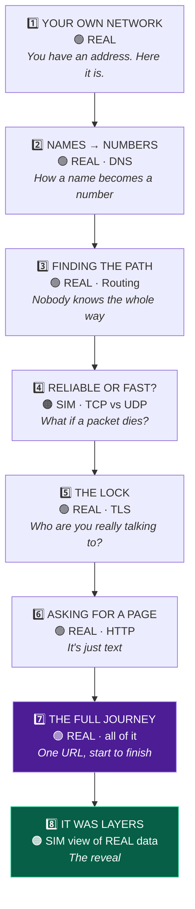

# 03 · The 8 Chapters

> **Design law:** max **3 lines of text**, then the user must DO something.
> If a screen has a paragraph on it, that screen is wrong.

---

## 🗺️ The arc



**Narrative spine — each chapter answers the question the last one created:**

```
"I have an address."          → but how do I find github's address?
"I ask a phonebook (DNS)."    → but how does my packet REACH it?
"It hops router to router."   → but what if a hop drops it?
"TCP re-sends. UDP doesn't."  → but anyone on the path can read it!
"TLS locks it."               → ok, so what do I actually SAY?
"HTTP. It's plain text."      → show me all of it together
"Here's the full journey."    → wait... this was organised in layers?
"Yes. That's OSI. Now it makes sense."   ✅
```

---

# 1️⃣ Your Own Network
**🟢 REAL** · `ipconfig` · `arp` · `route` · **~4h build**

### 🟢 Tier 1 — Story
```
Every device on a network has an address, like a house number.
Your computer has one right now. So does your router.
Let's look at yours.
```
Diagram: `[Your PC] ── cable ── [Router] ── ▶ 🌍 Internet`

### 🟡 Tier 2 — Do it
```
$ ifconfig
  Interface : Wi-Fi
  Your IP   : 192.168.1.5      ← this is YOU
  Subnet    : 255.255.255.0    ← "who is my neighbour"
  Gateway   : 192.168.1.1      ← the door out
  MAC       : a4:83:e7:1c:9f:22

$ arp
  192.168.1.1    a4:83:e7:00:11:22   ← your router, seen for real
  192.168.1.14   d8:3b:bf:aa:bb:cc   ← someone else's phone!
```
Canvas draws **their actual LAN** from the real ARP table. Every device that answers is a box.

**The hook:** *"That second device? That's someone's phone in your house. Your computer already knows about it."*

### 🔴 Tier 3 — Deeper
- Private vs public IP ranges (why `192.168.x.x` is not on the internet)
- Subnet mask as a bit mask — visual: IP bits AND mask bits
- MAC vs IP: *"MAC is your face, IP is your current address. Face never changes, address does."*

### 🏁 Challenge
> Find your router's MAC address and identify the vendor from the first 3 bytes (OUI).

**Kills:** `ip`, `network-interfaces`, `default-gateway`, `local-devices`

---

# 2️⃣ Names → Numbers (DNS)
**🟢 REAL** · our own DNS codec over `node:dgram` · **~8h build · HIGHEST PRIORITY**

### 🟢 Tier 1 — Story
```
Computers only understand numbers, not names.
DNS is the internet's phonebook: give a name, get a number.
Watch your computer ask, right now.
```

### 🟡 Tier 2 — Do it
```
$ dig github.com
  → 28 bytes  ──▶  8.8.8.8:53   (UDP)
  ← 44 bytes  ◀──  12.4 ms
  github.com.  60  IN  A  140.82.113.4
```
Canvas: a dot flies to the resolver and back. Narration under it.

More to try: `dig google.com AAAA` · `dig www.github.com` (see the CNAME!) · `dig nonexist.abcd` (NXDOMAIN)

### 🔴 Tier 3 — Real bytes 🔥
The **full DNS wire format**, decoded by our own parser:

```
 0000  1a 2b  01 00  00 01  00 00  00 00  00 00
       └ID─┘  └flg┘  └QD─┘  └AN─┘  └NS─┘  └AR─┘

 flags byte 0x01 = 0 0000 0 0 1
                   │ │    │ │ └ RD  Recursion Desired
                   │ │    │ └── TC  Truncated
                   │ │    └──── AA  Authoritative
                   │ └───────── Opcode (0 = standard query)
                   └─────────── QR  0 = question, 1 = answer

 0012  06 'g''i''t''h''u''b'  03 'c''o''m'  00
       └len 6┘ ─────────────  └len 3┘ ─────  └ root
       ⚠️ Names are NOT dotted strings on the wire!
          They are length-prefixed labels ending in a zero byte.
```

**Editable fields with hints:**

| Field | Try changing it to | Verified result |
|---|---|---|
| `QTYPE` `0x0001` | `0x001c` | **IPv6 comes back** ✅ — on `facebook.com`: `2a03:2880:f312:1:face:b00c:0:25de` 🥚 |
| `QTYPE` | `0x000f` | **MX** — the mail servers, with preference numbers ✅ |
| `QTYPE` | `0x0002` | **NS** — who actually owns this zone ✅ |
| `Header.ID` | anything | Reply arrives and is **rejected** ✅ — mismatch against the id we're waiting for |
| A `QNAME` length byte | wrong value | Parse fails; we show *where* it stopped ✅ |
| `RD` bit | `0` | ⚠️ **Unreliable** — a caching resolver answers anyway. Don't script the demo around it. |

> ⚠️ **`github.com` has no AAAA record.** Verified against 8 major domains — it is
> the only one without IPv6. Use `facebook.com`, `cloudflare.com` or `google.com`
> for the QTYPE edit.

### 🏁 Challenge
> Make the DNS server return an IPv6 address for github.com — **by editing one byte.**
>
> ⚡ Default resolver is `1.1.1.1` — measured at **6.5 ms** vs 8.8.8.8's 13.1 ms on the build machine.

### 💡 Why this chapter is the whole project
It is the smallest thing that shows *every* pillar: real packet · own codec · four zoom levels · editable · breakable. **If Chapter 2 works, the project works.**

**Kills:** `dns` (Node's own!), `dns-packet`, `dns2`, `native-dns`, `dig.js`

---

# 3️⃣ Finding the Path (Routing)
**🟢 REAL** · real `tracert` + your real routing table · **~6h build**

### 🟢 Tier 1 — Story
```
Your packet does not know the way to github.com.
Nobody does. Each router only knows the NEXT step.
Like asking for directions at every corner.
```

### 🟡 Tier 2 — Do it
```
$ route
  Destination      Gateway         Interface
  0.0.0.0/0        192.168.1.1     Wi-Fi      ← "don't know? send here"
  192.168.1.0/24   on-link         Wi-Fi      ← "neighbours, direct"

$ tracert github.com
  1   192.168.1.1        2 ms    your router
  2   10.24.0.1         12 ms    ISP
  3   172.16.4.9        18 ms    ISP core
  4   103.208.11.2      24 ms    Mumbai IX
  ...
  9   140.82.113.4      68 ms    🎯 GitHub
```
**Hops stream in live over SSE** — the canvas draws each router as it appears. Latency = link length. This is the most visually satisfying moment in the app.

### 🔴 Tier 3 — Deeper
- **TTL is the trick.** Send TTL=1 → first router says *"expired!"* → we learn hop 1. TTL=2 → hop 2. Repeat.
- Show TTL in a real packet counting down
- Why some hops show `* * *` (routers that refuse to reply) — **render these as ghost nodes labelled "this router chose not to answer", never as errors.** Pre-flight saw 2 of 5 hops do this.
- **TTL arithmetic:** a reply with `TTL=119` started at 128 → the server is **9 hops away**. You can count hops without traceroute.
- The default route `0.0.0.0/0` = *"I have no idea, ask my parent"*

### 🏁 Challenge
> Run `tracert` to a server in another country. Find the hop where latency jumps the most — that's usually the undersea cable.

**Kills:** `traceroute`, `nodejs-traceroute`, `netroute`, `default-gateway`

---

# 4️⃣ Reliable or Fast? (TCP vs UDP)
**🟠 SIM** (clearly labelled) · **~5h build** · ⚠️ **FIRST TO CUT IF BEHIND**

### 🟢 Tier 1 — Story
```
The internet loses packets. All the time. That's normal.
TCP notices and re-sends. UDP doesn't care and moves on.
Neither is "better" — it depends what you're doing.
```

### 🟡 Tier 2 — Do it
Split canvas. **Same packet loss applied to both.** One slider.

```
        loss: 30%   [▓▓▓░░░░░░░]

  TCP  ─────────────────────────────   UDP  ─────────────────────────────
   1 ✅  2 ✅  3 ❌  3 🔄  3 ✅  4 ✅     1 ✅  2 ✅  3 ❌  4 ✅  5 ✅
   file arrives PERFECT, but slower      call has a glitch, but no lag

   💾 downloading a file                 📞 voice call
```

### 🔴 Tier 3 — Deeper
- Real socket data from `curl`: connect RTT, local/remote port, bytes in/out
- **Ephemeral ports count up:** pre-flight saw `62028 → 62029 → 62030` on three connections. *"Your OS picks a fresh high port every time. Watch it increment."*
- Sequence numbers & ACKs (diagram)
- Head-of-line blocking: why one lost packet stalls *everything* after it in TCP
- **Honest box:** *"Raw TCP headers are handled by your OS kernel. Node's stdlib gives us the socket, not the SYN/ACK bytes. We show what is genuinely observable."*

### 🏁 Challenge
> At what loss % does TCP take more than 2× the time of UDP? Explain in one line why.

**Kills:** `simple-peer`(concept), `reliable-udp`

---

# 5️⃣ The Lock (TLS / HTTPS)
**🟢 REAL** · our own ClientHello + our own X.509 parser · **~8h build**

### 🟢 Tier 1 — Story
```
Every router on the path can read your packets.
HTTPS fixes this: first a handshake, then everything is locked.
The 🔒 in your browser is this handshake succeeding.
```

### 🟡 Tier 2 — Do it
```
$ tls github.com
  → ClientHello   517 B   "hi, I speak TLS 1.3, here are my ciphers"
  ← ServerHello  3821 B   "let's use TLS 1.3 + AES-256-GCM"
  ← Certificate           "and here's my ID card"

  Subject     CN = github.com
  Issuer      Sectigo ECC Domain Validation Secure Server CA
  Valid       2025-02-05  →  2026-02-05      ✅ 163 days left
  SANs        github.com, www.github.com
  Key         ECDSA P-256
  Chain       github.com → Sectigo ECC → USERTrust ECC  (3 certs)
```

### 🔴 Tier 3 — Real bytes 🔥
```
 TLS Record
 16 03 01 02 00 | 01 00 01 fc | 03 03 | <32 random bytes> | ...
 │  └ver┘ └len┘   │  └─len──┘   └ver┘   └── client random ──┘
 └ 0x16 = Handshake
                 └ 0x01 = ClientHello

 Extensions:
   00 00  SNI            "github.com"   ← the only unencrypted hostname!
   00 2b  supported_versions  TLS 1.3
   00 0a  supported_groups    x25519, secp256r1
   00 0d  signature_algorithms
```

**Editable — this section produces the best demo moments:**

| Change | Verified result |
|---|---|
| 🏆 **SNI swap** — connect to `medium.com`'s IP, set SNI to `discord.com` | Get **`CN=discord.com`** back from Medium's server 🤯 ✅ *confirmed* |
| **Remove SNI** on a Cloudflare host (`medium.com`, `blog.cloudflare.com`) | 🔴 **fatal alert 2/40 — handshake_failure** ✅ *confirmed* |
| Remove SNI on `github.com` | ❌ Nothing happens — dedicated IP. **Don't use github for this demo.** |
| Corrupt the record length | Connection closed instantly |

**The SNI swap is the single best moment in the project.** One IP, thousands of sites, and the
only unencrypted name in the whole handshake. It also explains why your ISP still sees which
sites you visit over HTTPS. See [pre-flight results](07-PREFLIGHT-RESULTS.md#4️⃣-sni-experiments--chapter-5s-demo-climax--confirmed-spectacular).

> ⚠️ **We deliberately offer TLS 1.2, not 1.3.** In TLS 1.3 the Certificate message is
> *encrypted* — we'd see nothing. In 1.2 it is plaintext DER we can parse ourselves.
> This is itself a Tier-3 lesson: *"why can we read this certificate? Because we asked for
> older crypto. That's exactly what TLS 1.3 fixed."*

### 🏁 Challenge
> Connect to `medium.com`'s IP but ask for `discord.com` in the SNI field. Whose certificate comes back? Explain in one line why one IP can serve thousands of sites.

### 🚧 Honest scope
We build & send a real ClientHello and parse the real ServerHello + full certificate chain (our own ASN.1/DER parser). We **do not** implement the TLS key schedule — `node:tls` (stdlib) carries the encrypted transfer in Ch 6.

**Kills:** `x509`, `node-forge`, `pem`, `asn1.js`, `tls-parser`, `sslcert`, `get-ssl-certificate`

---

# 6️⃣ Asking for a Page (HTTP)
**🟢 REAL** · handwritten request + our own response parser · **~5h build**

### 🟢 Tier 1 — Story
```
After all that setup, the actual request is... plain English text.
"GET /users HTTP/1.1" — that's it. You could type it by hand.
Let's type it by hand.
```

### 🟡 Tier 2 — Do it
```
$ curl https://example.com

  ── we send (142 bytes, literally these characters) ──
  GET / HTTP/1.1
  Host: example.com
  User-Agent: netlens/1.0
  Connection: close
  ⏎⏎                          ← the blank line means "I'm done"

  ── server replies ──
  HTTP/1.1 200 OK
  Content-Type: text/html; charset=UTF-8
  Transfer-Encoding: chunked
  ...
```

### 🔴 Tier 3 — Deeper
- **Chunked encoding decoded live:** `1a7\r\n<423 bytes>\r\n0\r\n\r\n` → *"the server didn't know the total size, so it sent it in pieces"*
- Try `Connection: keep-alive` → **the socket stays open.** Watch the second request skip DNS + TCP + TLS entirely
- Status codes: force a `301`, a `404`, a `304 Not Modified`
- Headers are ASCII with `\r\n` — **change a `\r\n` to `\n` and watch some servers break**

### 🏁 Challenge
> Make a server respond `304 Not Modified` by sending the right conditional header.

**Kills:** `axios`, `node-fetch`, `got`, `request`, `superagent`, `http-parser-js`, `undici`(concept)

---

# 7️⃣ The Full Journey ⭐ DEMO CLIMAX
**🟢 REAL** · everything chained · **~4h build (mostly assembly)**

### 🟢 Tier 1 — Story
```
You now know every piece. Let's watch them all fire, in order, for one URL.
```

### 🟡 Tier 2 — Do it
```
$ journey https://github.com
```

One continuous animation. **Nothing new is built — Ch 2/3/5/6 already produced all of this.**

```
   0.0 ms  🔍  DNS query        →  8.8.8.8            28 B    ┐
  12.4 ms  🔍  DNS response     ←  140.82.113.4       44 B    │ Ch 2
  12.5 ms  🛣️  route lookup     →  via 192.168.1.1            ┐ Ch 3
  31.0 ms  🤝  TCP connect      →  140.82.113.4:443           ┘ Ch 4
  31.2 ms  🔐  TLS ClientHello  →                    517 B    ┐
  62.1 ms  🔐  ServerHello+Cert ←                   3821 B    │ Ch 5
  62.4 ms  🔒  handshake done      cipher AES-256-GCM         ┘
  63.0 ms  📄  HTTP GET /       →                    142 B    ┐ Ch 6
  95.3 ms  📄  HTTP 200 OK      ←                    8.2 KB   ┘
  95.4 ms  🎨  browser renders

  Total: 95.4 ms   ·   4 protocols   ·   6 round trips   ·   12.1 KB
```

**The line that lands with judges:**
> *"You did this ten thousand times today. Here is what actually happened, byte for byte. **Zero libraries were involved.**"*

### 🔴 Tier 3 — Deeper
- **Cost breakdown:** DNS 13% · TCP 20% · TLS 33% · HTTP 34% → *"a third of your page load is TLS handshake — this is WHY keep-alive, HTTP/2 and 0-RTT exist"*
- Run it twice → second run is 3× faster (DNS cached, TCP reused) → **caching explained by experience, not definition**
- Click any step → jump straight into that chapter

### 🏁 Challenge
> Run `journey` twice on the same site. Which stage disappeared? Why?

---

# 8️⃣ It Was Layers All Along ⭐ THE REVEAL
**🟠 SIM view of REAL data** · **~5h build**

### 🟢 Tier 1 — Story
```
Everything you just learned was organised in layers. You already know all of them.
Here are their real names.
```

### 🟡 Tier 2 — Do it
Take **a real captured packet from Ch 7** and peel it:

```
   ┌───────────────────────────────────────────────────────┐
   │ Ethernet   dst a4:83:e7…  src d8:3b:bf…      14 B     │  L2  ← Ch 1 (MAC)
   │ ┌───────────────────────────────────────────────────┐ │
   │ │ IP       192.168.1.5 → 140.82.113.4  TTL 64  20 B │ │  L3  ← Ch 3 (routing)
   │ │ ┌───────────────────────────────────────────────┐ │ │
   │ │ │ TCP    :54127 → :443   seq 1  ACK      20 B   │ │ │  L4  ← Ch 4 (TCP)
   │ │ │ ┌───────────────────────────────────────────┐ │ │ │
   │ │ │ │ TLS  application_data          encrypted  │ │ │ │  L5-6 ← Ch 5
   │ │ │ │ ┌───────────────────────────────────────┐ │ │ │ │
   │ │ │ │ │ HTTP   GET / HTTP/1.1        142 B    │ │ │ │ │  L7  ← Ch 6
   │ │ │ │ └───────────────────────────────────────┘ │ │ │ │
   │ │ │ └───────────────────────────────────────────┘ │ │ │
   │ │ └───────────────────────────────────────────────┘ │ │
   │ └───────────────────────────────────────────────────┘ │
   └───────────────────────────────────────────────────────┘

   [ ◀ unwrap ]   [ wrap ▶ ]     ← animate the peel, layer by layer
```

Every layer label links back: *"you learned this in Chapter 3."*

### 🔴 Tier 3 — Deeper
- **Encapsulation animation:** data goes down the stack gaining a header at each layer, travels, then goes up losing them. This is the *entire* meaning of "the network stack".
- OSI 7 vs TCP/IP 4 side by side — and the honest note: *"OSI 5 & 6 barely exist in practice. Nobody tells you that."*
- Overhead maths: `54 bytes of headers for 142 bytes of payload = 27% overhead`

### 🏁 Challenge
> Which layer would you change to move this app to a different country's server? Which layer to switch from HTTP to a chat protocol? (L3 · L7)

### 💡 Why last, not first
Layers are an **organising principle**, not an introduction. Presented on day 1 they are seven meaningless words. Presented on day 8, they are the moment everything clicks into place. **This inversion is our Innovation score.**

---

## ⏱️ Build cost & cut order

| Ch | Build | Demo value | Risk | Cut priority |
|:--:|:--:|:--:|:--:|:--:|
| 2 DNS | 8h | 🔥🔥🔥🔥🔥 | Low | **Never — this IS the project** |
| 7 Journey | 4h | 🔥🔥🔥🔥🔥 | Low | Never — it's just assembly |
| 5 TLS | 8h | 🔥🔥🔥🔥 | **High** (ASN.1) | Never, but timebox hard |
| 3 Routing | 6h | 🔥🔥🔥🔥 | Med (OS parsing) | Late |
| 1 Your network | 4h | 🔥🔥🔥 | Low | Late |
| 6 HTTP | 5h | 🔥🔥🔥 | Low | Late |
| 8 Layers | 5h | 🔥🔥🔥🔥 | Med | **Cut #2** |
| 4 TCP/UDP | 5h | 🔥🔥 | Low | **Cut #1** ✂️ |

**Minimum shippable course (if everything goes wrong): 1 → 2 → 5 → 6 → 7.**
Five chapters, all REAL, complete narrative arc, full demo intact.

---

**➡️ Next:** [04-72-HOUR-PLAN.md](04-72-HOUR-PLAN.md)
