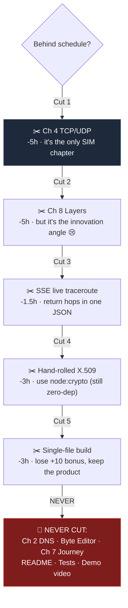

# 04 · The 72-Hour Plan

> **Solo build.** ~54 working hours, ~18 hours sleep/food/breaks.
> ⚠️ **Rule: the checkpoint at the end of each block is a GATE.**
> Miss a gate → cut from the cut-list immediately. Do not "catch up later." You never do.

---

## 🗓️ Bird's-eye view

```mermaid
gantt
    title 72 Hours — Solo
    dateFormat HH
    axisFormat %H

    section DAY 1 · PROVE IT
    Skeleton + server + verify-zero-dep   :a1, 00, 3h
    DNS codec + tests (fixtures)          :a2, after a1, 5h
    Terminal emulator + dig               :a3, after a2, 4h
    Canvas + tween + scene                :a4, after a3, 4h
    🔒 GATE 1 · vertical slice            :milestone, crit, after a4, 0h
    SLEEP                                 :done, 16, 7h

    section DAY 2 · BREADTH
    Inspector + hex + BYTE EDITOR         :b1, 23, 5h
    Ch 1 + sys parsers                    :b2, after b1, 4h
    Ch 3 routing + SSE traceroute         :b3, after b2, 4h
    TLS + X509 parser                     :b4, after b3, 5h
    🔒 GATE 2 · 4 chapters live           :milestone, crit, after b4, 0h
    SLEEP                                 :done, 41, 6h

    section DAY 3 · SHIP
    HTTP + Ch 6 + Ch 7 journey            :c1, 47, 5h
    Ch 4 + Ch 8 (cuttable)                :c2, after c1, 5h
    build.js single file + reproducible   :c3, after c2, 3h
    Tests + README + STDLIB + proof       :c4, after c3, 4h
    Demo video + submit                   :c5, after c4, 3h
    🔒 GATE 3 · SUBMITTED                 :milestone, crit, 69, 0h
    BUFFER                                :69, 3h
```



---

# 🌅 DAY 1 — "Prove the hard thing works"

> **Day 1 goal: ONE chapter working end-to-end.** Not eight half-chapters.
> If `dig github.com` animates and shows real editable hex by hour 16, the project is safe.

## Block 1 · H00–H03 — Skeleton (3h)

| ⏱ | Task | Output |
|---|---|---|
| H00–H00:30 | `git init`, `package.json` (deps `{}`), `.gitignore`, folder tree | repo exists |
| H00:30–H01 | **`verify-zero-dep.js` FIRST** — before any code | ✅ passes on empty repo |
| H01–H02 | `run.js` + `src/server/server.js` + `static.js` — serve `web/index.html` | `node run.js` → localhost:7777 shows "hello" |
| H02–H02:30 | `web/js/state.js`, `dom.js`, `router.js` — the 200-line "framework" | hash routing works |
| H02:30–H03 | `test/` + one dummy `node --test` | `npm test` green |

> 💡 **Why `verify-zero-dep.js` on hour 0?** It's your guardrail for 72 hours. Written on Day 3 it
> finds a violation you have no time to fix. Written on hour 0 it prevents one.

**🔒 CHECKPOINT:** `npm start`, `npm test`, `npm run verify` — all three green.

---

## Block 2 · H03–H08 — DNS codec ⭐ (5h)

**This is the highest-value block in the entire hackathon. Do not rush it. Do not skip the tests.**

| ⏱ | Task |
|---|---|
| H03–H03:30 | `shared/bytes.js` — `BitReader`, `BitWriter`, `hexToBytes`, `bytesToHex`, span helper |
| H03:30–H05:30 | `proto/dns.js` **encode()** — header, QNAME label-encoding, QTYPE/QCLASS |
| H05:30–H06 | `proto/dns-client.js` — `node:dgram`, timeout, retry |
| H06–H06:15 | **Capture fixtures:** run it once for real, dump query+response hex to `test/fixtures/` |
| H06:15–H08 | `proto/dns.js` **decode()** — answers, **name compression pointers (0xC0)**, A/AAAA/CNAME/MX/TXT/NS, `_spans` for every field |

### ⚠️ The 3 traps in DNS parsing (budget time for these)
```
1. Name compression   0xC0 0x0C  = "jump to offset 12"
   Miss this → every real response fails to parse. It is used ALWAYS.

2. QNAME encoding     "github.com" → 06 g i t h u b 03 c o m 00
   Not a dotted string. Length-prefixed labels + zero terminator.

3. Spans              Every field needs {offset, length} (+ {bitOffset,bitLength} for flags)
   Retrofitting these later = rewriting the whole parser. Build them in from line 1.
```

**🔒 CHECKPOINT:** `node --test test/dns.test.js` passes with real captured fixtures.
`decode(encode(q))` round-trips. **A real `dig` returns a real IP.**

---

## Block 3 · H08–H12 — Terminal emulator (4h)

| ⏱ | Task |
|---|---|
| H08–H10 | `web/js/term/terminal.js` — hidden input, blinking cursor, output lines, scrollback, ↑↓ history, `Ctrl+L` |
| H10–H11 | `term/commands.js` — registry, arg parsing, `help`, `clear`, `dig` |
| H11–H11:30 | `api.js` + `POST /api/dns` wired end-to-end |
| H11:30–H12 | `autocomplete.js` — Tab completion + inline hints |

**🔒 CHECKPOINT:** Type `dig github.com` in the browser → real dig-style output appears.

---

## Block 4 · H12–H16 — Canvas + animation (4h)

| ⏱ | Task |
|---|---|
| H12–H13 | `viz/canvas.js` — rAF loop, devicePixelRatio scaling, resize |
| H13–H13:45 | `viz/anim.js` — tween engine + easings (~80 lines) |
| H13:45–H15 | `viz/scene.js` + `draw.js` — node/link/packet model, device & server icons, cables |
| H15–H15:30 | `inspect/timeline.js` — event rows, click to select |
| H15:30–H16 | **WIRE IT ALL:** `dig` → packet flies across canvas → timeline fills → narration shows |

---

## 🔒🔒 GATE 1 · H16 — THE VERTICAL SLICE

```
┌───────────────────────────────────────────────────────────────┐
│  Type `dig github.com` in the browser terminal                 │
│    → a REAL UDP packet leaves the machine                      │
│    → a dot animates across the canvas to 8.8.8.8 and back      │
│    → the timeline shows both events with narration             │
│    → the real IP is printed                                    │
└───────────────────────────────────────────────────────────────┘
```

### ✅ PASSED

Verified live in the browser at 1440x860: `dig facebook.com AAAA` sends a real
UDP packet, a green dot flies back from 1.1.1.1 carrying its byte count, both
nodes light up, the timeline fills and the narration explains it in one sentence.
Screenshot: [img/gate1-packet-in-flight.png](img/gate1-packet-in-flight.png)

Ahead of plan: the byte-editor API path (Block 5) already works, and `replay`
lets the same exchange be re-watched at up to 10x slower.

| Status at H16 | Action |
|---|---|
| ✅ Works | On track. Sleep. Day 2 is breadth. |
| ⚠️ 80% done | Push to H18, sleep 6h, **cut Ch 4 and Ch 8 now** |
| ❌ DNS parsing broken | **Emergency:** cut Ch 4, 8, AND 3. Target 5 chapters. |

## 😴 H16–H23 — SLEEP (7h, non-negotiable)
Debugging a DER parser on 3 hours of sleep is how solo hackathons die.

---

# 🌤️ DAY 2 — "Breadth + the climax"

## Block 5 · H23–H28 — Inspector + BYTE EDITOR ⭐ (5h)

**This block contains the single most important feature in the project.**

| ⏱ | Task |
|---|---|
| H23–H24 | `inspect/tree.js` — collapsible field tree from `packet.tree`, hover → emit span |
| H24–H25 | `inspect/hex.js` — hex grid, ASCII gutter, span highlight synced to the tree |
| H25–H25:30 | `inspect/bits.js` — bit ruler for the selected byte, flag names above bits |
| H25:30–H27 | ✏️ **`inspect/editor.js`** — `[e]` edit a byte inline, `[r]` re-send, `rawOverride` → API |
| H27–H28 | `explain.js` field explanations + `?` popover |

**🔒 CHECKPOINT — THE MONEY SHOT:**
> Edit byte `0x1c` from `01` → `1c`, press re-send, **get a real IPv6 address back.**
>
> If this works, you have a winning demo. Record a screen capture **right now** as insurance.

---

## Block 6 · H28–H32 — Chapter 1 + sys parsers (4h)

| ⏱ | Task |
|---|---|
| H28–H28:45 | `sys/exec.js` — `execFile` allowlist, hostname regex validation, timeouts |
| H28:45–H30 | `sys/netinfo.js` — parse `ipconfig`/`ifconfig`, `arp -a`, `route print`/`ip route`, `netstat` |
| H30–H30:45 | `sys/ping.js` — parse Windows + Linux + macOS output shapes |
| H30:45–H31:15 | Fixtures for all of the above → `sysparse.test.js` |
| H31:15–H32 | `lesson/engine.js` (3-tier runner) + `ch01-your-network.js` |
| +30 min | 🩺 `tools/doctor.js` + `doctor` command — port the pre-flight script. Graceful degradation on a judge's locked-down network. [Why](07-PREFLIGHT-RESULTS.md) |

> ⚠️ **Windows/Linux output differs a lot.** Write both parsers now with fixtures. Do not
> discover this at H60 on a judge's machine.

---

## Block 7 · H32–H36 — Chapter 3 routing + live traceroute (4h)

| ⏱ | Task |
|---|---|
| H32–H33 | `sys/trace.js` — spawn tracert/traceroute, parse hops incrementally |
| H33–H34 | `server/sse.js` + `GET /events` + `api.js` SSE client |
| H34–H35 | Canvas multi-hop scene: routers appear live, link length ∝ latency |
| H35–H36 | `ch03-routing.js` + `route` command + challenge check |

**🔒 CHECKPOINT:** `tracert github.com` → routers pop onto the canvas one by one, live.
**This is the second-best visual in the app. Screen-record it as insurance.**

---

## Block 8 · H36–H41 — TLS + X.509 ⚠️ HIGHEST RISK (5h)

> **HARD TIMEBOX.** At H41, whatever state this is in, you stop and move on.
> ASN.1/DER is a swamp. Do not let it eat Day 3.

| ⏱ | Task | Fallback if stuck |
|---|---|---|
| H36–H37 | `tls.js buildClientHello()` — ⚠️ **offer TLS 1.2 only** (see below). Record header, random, cipher list, SNI + supported_groups + ec_point_formats + signature_algorithms | ✅ working code already exists in the pre-flight script |
| H37–H37:30 | `tls-probe.js` — `node:net`, send, collect ServerHello + Certificate, close | — |
| H37:30–H38:30 | `tls.js parseServerHello()` — chosen version + cipher suite | — |
| H38:30–H40:30 | 🐊 **`x509.js`** — DER TLV walker → Subject CN, Issuer, validity dates, SANs, key algo | **Fallback:** use `node:crypto` `X509Certificate` (stdlib, still zero-dep!) and show raw DER bytes alongside. **Ship this instead of failing.** |
| H40:30–H41 | `ch05-tls.js` + SNI-removal edit + challenge | — |

> 💡 **Pre-decided fallback = no panic.** `node:crypto.X509Certificate` is standard library.
> Using it is 100% legal. Losing 4 hours to ASN.1 on Day 2 is not.

---

## 🔒🔒 GATE 2 · H41

```
✅ Chapters 1, 2, 3, 5 playable end to end
✅ Byte editor works
✅ Terminal has: dig, ping, tracert, tls, route, arp, ifconfig
✅ Live traceroute animation
```

| Status | Action |
|---|---|
| ✅ All four | Day 3 comfortable. Build Ch 4 + 8. |
| ⚠️ Three of four | **Cut Ch 4 now.** Ch 8 only if H60 arrives early. |
| ❌ Two | **Cut Ch 4 AND Ch 8.** Ship 6 chapters, polished. That still wins. |

## 😴 H41–H47 — SLEEP (6h)

---

# 🌇 DAY 3 — "Ship it"

> ⚠️ **The classic solo hackathon death: coding until hour 71.**
> **H60 is a hard code freeze.** Everything after H60 is docs, tests, demo, submission.
> A brilliant unsubmitted project scores zero.

## Block 9 · H47–H52 — HTTP + Ch 6 + Ch 7 ⭐ (5h)

| ⏱ | Task |
|---|---|
| H47–H48 | `http.js buildRequest()` + `parseResponse()` — status line, headers, **chunked transfer decoding** |
| H48–H48:30 | `http-client.js` over `node:tls` + `curl` command |
| H48:30–H49:15 | Fixtures + `http.test.js` (chunked, header folding, no-body responses) |
| H49:15–H50 | `ch06-http.js` |
| H50–H52 | 🏆 **`ch07-journey.js`** — chain DNS → connect → TLS → HTTP into one timeline + one animation, plus the cost-breakdown bar |

**🔒 CHECKPOINT:** `journey https://github.com` plays the complete story. **This is your demo climax.**

---

## Block 10 · H52–H57 — Ch 4 + Ch 8 ✂️ CUTTABLE (5h)

| ⏱ | Task | Cut? |
|---|---|---|
| H52–H54:30 | `sim/reliability.js` + `ch04-tcp-udp.js` — loss slider, split TCP/UDP canvas | ✂️ **Cut #1** |
| H54:30–H57 | `viz/layers.js` + `ch08-layers.js` — encapsulation wrap/unwrap animation | ✂️ **Cut #2** |

> If you are behind at H52: **skip straight to Block 11.** Six polished chapters beat eight rushed ones
> on a rubric that weights Code Quality at 25%.

---

## Block 11 · H57–H60 — Build system 🏆 bonus +10 (3h)

| ⏱ | Task |
|---|---|
| H57–H59 | `build.js` — resolve imports, concat `src/`, inline `web/` assets as string constants → `dist/netlens.js` |
| H59–H59:30 | Determinism: sorted traversal, no timestamps, no random ids, forced `\n` |
| H59:30–H60 | `test/build.test.js` — build twice, assert identical sha256 → write `BUILD-HASH.txt` |

**🔒 CHECKPOINT:** `node dist/netlens.js` works identically. Two builds → same hash. **+5 and +5 secured.**

---

## 🧊 H60 — CODE FREEZE. NO NEW FEATURES.

---

## Block 12 · H60–H64 — Tests + Docs 🏆 (4h)

| ⏱ | Task | Rubric |
|---|---|---|
| H60–H61:30 | Fill test gaps. Target **40+ tests**, all offline, `node --test` | Code Quality 25% |
| H61:30–H62:30 | **`README.md`** — 60-second pitch, GIF, one-command install, honest limitations | Functionality 35% |
| H62:30–H63:30 | **`STDLIB.md`** — every stdlib module, what it replaced, *why* it was interesting | Bonus +3 |
| H63:30–H64 | **`DEPENDENCY-PROOF.md`** — `verify` output, `npm ls`, empty lockfile, `node_modules` absent | Bonus +3, Craft 30% |

### README structure (judges read the top 30 lines and decide)
```
1. One sentence + one GIF of the byte editor breaking DNS   ← 10 seconds to "I get it"
2. node run.js                                              ← the one command
3. What it does — the 8 chapters, one line each
4. The zero-dependency story — verify output pasted inline
5. Architecture diagram (steal from docs/01)
6. Honest limitations                                        ← judges reward this
7. Tests: node --test  (40 passing)
8. Bonus checklist with ✅
```

---

## Block 13 · H64–H67 — Demo video (3h)

| ⏱ | Task |
|---|---|
| H64–H64:30 | Write the script → [06-DEMO-SCRIPT.md](06-DEMO-SCRIPT.md) |
| H64:30–H65 | **Rehearse twice.** Live typing fails on camera — practice the exact keystrokes |
| H65–H66 | Record. Multiple takes of the byte-editor moment. |
| H66–H67 | Trim, add captions for the key moments, export |

> 🎥 **Record every "wow" moment separately as backup footage** the moment it first works.
> If the network flakes during the real take, you still have the shot.

---

## Block 14 · H67–H69 — Submit (2h)

- [ ] Fresh clone in a clean folder → `node run.js` → works
- [ ] `npm test` green
- [ ] `node verify-zero-dep.js` green
- [ ] `node dist/netlens.js` green
- [ ] All docs committed, links not broken
- [ ] Video uploaded, link works in incognito
- [ ] **SUBMIT**

## H69–H72 — Buffer 🛟
Something will break. It always does. This is why the freeze is at H60.

---

## ✂️ The cut list (decide once, execute without emotion)



---

## 🚨 Risk register

| Risk | Prob | Impact | Pre-decided response |
|---|:--:|:--:|---|
| DNS name-compression bug | High | 🔴 Fatal | Budget 2h. Fixtures first. Ask AI for the 0xC0 pointer algorithm on hour one. |
| ASN.1/DER swamp | ~~High~~ **Med** | 🟠 High | ✅ **De-risked** — [pre-flight](07-PREFLIGHT-RESULTS.md) confirms plaintext DER arrives. Write our parser and assert its output equals `crypto.X509Certificate`'s — safety net *and* a test. Timebox H41 still stands. |
| Windows vs Linux `tracert` output | High | 🟡 Med | Write both parsers Day 2 with fixtures. Detect via `process.platform`. |
| ~~Firewall blocks UDP 53 / ICMP~~ | — | — | ✅ **CLOSED.** [Pre-flight](07-PREFLIGHT-RESULTS.md): UDP 53 ✅ (3 resolvers), ICMP ✅, tracert ✅, TCP 443 ✅. Keep `--resolver` flag anyway for the judge's machine. |
| Canvas animation eats a whole day | Med | 🟠 High | ONE generic scene engine. Chapters are data. Timebox 4h. |
| No time for the video | Med | 🔴 Fatal | **H60 freeze.** Record backup clips as features land. |
| Judge's machine has no `traceroute` | Low | 🟡 Med | Graceful error + cached demo data. |

---

## 📅 Daily ritual (10 min, non-negotiable)

**Every morning:**
1. Read GATE status honestly. Not hopefully.
2. Execute the cut list if you missed a gate. **No negotiation.**
3. `git commit` — you will want to roll back at 3 AM.

**Every evening:**
1. Append today's stdlib modules to `STDLIB.md` (5 min now vs 90 min on Day 3)
2. Screen-record anything new that looks impressive
3. Push to remote

---

**➡️ Next:** [05-ZERO-DEP-STRATEGY.md](05-ZERO-DEP-STRATEGY.md)
