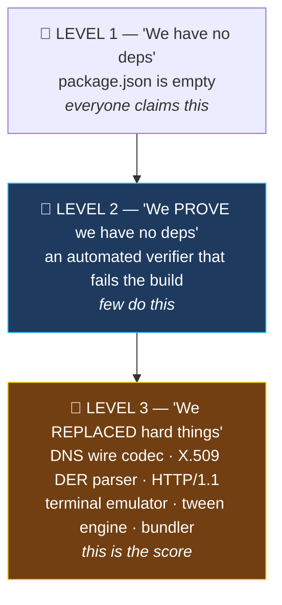
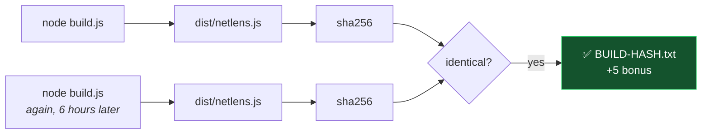

# 05 · Zero-Dependency Strategy

> **30% of the score.** Plus **+6 in bonuses** (Package Killer +3, STDLIB Log +3).
> This doc is not an afterthought — it is a third of the grade.

---

## 🎯 The three levels of "zero dependency"



**We do all three.** Level 3 is what separates a 20/30 from a 30/30.

---

## 📦 Package Killer table

> Auto-generated into `STDLIB.md` from the `killed: []` array in each chapter file
> plus a static list for infrastructure modules. **Never hand-maintained.**

### 🖥️ Server side

| npm package | weekly dl | We replaced it with | Our file |
|---|---:|---|---|
| `dns-packet` | 20M | Hand-written DNS wire encoder/decoder + name compression | `proto/dns.js` |
| `dns2` | 90K | `node:dgram` client with timeout/retry | `proto/dns-client.js` |
| `axios` | 55M | Handwritten HTTP/1.1 request builder | `proto/http.js` |
| `node-fetch` | 60M | `node:tls` socket + our own parser | `proto/http-client.js` |
| `got` | 25M | ditto | `proto/http-client.js` |
| `http-parser-js` | 12M | Status line + headers + **chunked** decoder | `proto/http.js` |
| `node-forge` | 25M | Minimal ASN.1/DER TLV walker | `proto/x509.js` |
| `asn1.js` | 30M | ditto | `proto/x509.js` |
| `x509` / `pem` | 1M | Certificate field extraction | `proto/x509.js` |
| `get-ssl-certificate` | 200K | Raw ClientHello probe | `proto/tls-probe.js` |
| `ws` / `socket.io` | 60M | Server-Sent Events in 40 lines | `server/sse.js` |
| `express` | 40M | `node:http` + a route table | `server/routes.js` |
| `serve-static` | 15M | MIME map + stream | `server/static.js` |
| `traceroute` / `nodejs-traceroute` | 30K | `child_process` + our own output parser | `sys/trace.js` |
| `ping` | 500K | ditto | `sys/ping.js` |
| `default-gateway` | 8M | `route print` / `ip route` parser | `sys/netinfo.js` |
| `hexy` | 300K | Hex dump formatter | `proto/hexdump.js` |
| `chalk` | 200M | ANSI codes (CLI output) | `run.js` |
| `dotenv` | 40M | `node:util.parseArgs` + env | `run.js` |
| `jest` / `mocha` / `chai` | 60M | `node:test` + `node:assert` | `test/` |
| `webpack` / `esbuild` / `rollup` | 100M | 120-line import resolver + concatenator | `build.js` |
| `nodemon` | 5M | `fs.watch` (dev mode) | `run.js` |

### 🌐 Browser side

| npm package | weekly dl | We replaced it with | Our file |
|---|---:|---|---|
| `react` + `react-dom` | 30M | 60-line pub/sub store + `el()` DOM helper | `state.js`, `dom.js` |
| `redux` / `zustand` | 15M | the same 60 lines | `state.js` |
| `react-router` | 12M | `hashchange` listener | `router.js` |
| `xterm.js` | 2M | Hand-built terminal: input, cursor, history, scrollback | `term/terminal.js` |
| `gsap` / `anime.js` | 3M | `requestAnimationFrame` + easing functions | `viz/anim.js` |
| `framer-motion` | 8M | ditto | `viz/anim.js` |
| `d3` | 5M | Direct Canvas2D drawing | `viz/draw.js` |
| `pixi.js` / `konva` | 2M | ditto | `viz/canvas.js` |
| `mermaid` (runtime) | 2M | Hand-drawn canvas diagrams | `viz/layers.js` |
| `tailwindcss` / `bootstrap` | 15M | CSS custom properties + grid | `css/theme.css` |
| `jquery` | 5M | `el()` — 50 lines | `dom.js` |
| `highlight.js` | 3M | Span-based hex/byte highlighting | `inspect/hex.js` |

### 🧮 Headline number

```
   ~35 npm packages replaced
   ~700 million weekly downloads represented
    0 dependencies
```

> Put that block in the README. Put it on the demo's last slide.

---

## 📚 Standard library modules we use

| Module | Used for | Interesting bit for `STDLIB.md` |
|---|---|---|
| `node:dgram` | Real DNS over UDP | `send(buf, port, host)` gives byte-exact control — this is what makes the byte editor possible |
| `node:net` | Raw TCP for the TLS probe | We write the ClientHello ourselves onto a bare socket |
| `node:tls` | Encrypted transfer for HTTP | `getPeerCertificate()` cross-checks our own parser |
| `node:http` | Server, static, JSON API, SSE | `res.writeHead` + manual `\n\n` framing = full SSE, no library |
| `node:child_process` | `execFile` for ping/tracert/route/arp | `execFile` (not `exec`) = no shell = no injection surface |
| `node:crypto` | Random ids, sha256 build hash, X.509 fallback | `X509Certificate` is stdlib and underrated |
| `node:fs` / `node:fs/promises` | Progress store, static files, build | `writeFile` to temp + `rename` = atomic saves |
| `node:path` / `node:url` | Path handling, ESM `import.meta.url` | Cross-platform paths without `path-to-regexp` |
| `node:buffer` | All byte manipulation | `readUInt16BE` / `writeUInt16BE` are the whole DNS parser |
| `node:util` | `parseArgs` for CLI flags | Killed `dotenv`, `yargs`, `commander` in one line |
| `node:events` | SSE broadcast bus | `EventEmitter` replaces a pub/sub package |
| `node:zlib` | gzip/deflate HTTP responses | `gunzipSync` — `Content-Encoding: gzip` handled |
| `node:test` + `node:assert` | 40+ tests | Zero test dependencies at all — not even dev |
| `node:os` | Platform detection for parsers | Chooses the `tracert` vs `traceroute` parser |
| **Browser** `Canvas2D` | All visuals | |
| **Browser** `fetch` / `EventSource` | API + SSE | `EventSource` is native — that's why SSE beat WebSocket |
| **Browser** `TextEncoder/Decoder` | ASCII gutter in hex view | |
| **Browser** `localStorage` | Theme + last chapter | |

---

## 🛡️ `verify-zero-dep.js` — the proof artifact

**~40 lines. Written at hour 0. Run in `npm test`.** It is your best single Craft signal.

```js
// pseudo
for (const file of walk(['src','web','test','build.js','run.js','verify-zero-dep.js'])) {
  for (const spec of extractImports(file)) {
    if (spec.startsWith('node:'))        ok('builtin', spec)
    else if (/^\.\.?\//.test(spec))      ok('relative', spec)
    else                                 fail(`${file}: third-party import "${spec}"`)
  }
}
assertEmpty(pkg.dependencies)
assertEmpty(pkg.devDependencies)
assertAbsent('node_modules')
assertLockfileHasNoPackages()
```

### The output you paste into the README

```
$ node verify-zero-dep.js

  ┌─ ZERO DEPENDENCY VERIFICATION ─────────────────────────┐

    files scanned .......... 47
    imports found .......... 132
      ├─ relative .......... 118  ✅
      ├─ node: builtins ....  14  ✅
      └─ third-party ....... 000  ✅

    node: modules used:
      assert  buffer  child_process  crypto  dgram  events
      fs  http  net  os  path  test  tls  url  util  zlib

    package.json  dependencies ......... {}        ✅
    package.json  devDependencies ...... {}        ✅
    package-lock.json  packages ........ 1 (root)  ✅
    node_modules/ ...................... absent    ✅

  └────────────────────────────────────────────────────────┘

  🏆 ZERO DEPENDENCY VERIFIED
```

### ⚠️ Also blocks the sneaky ones
```
❌ import x from 'node_modules/...'
❌ require(variable)          → dynamic require, must be flagged
❌ await import('http')       → non-prefixed builtin, still flagged for style
❌ <script src="https://cdn..."> in web/index.html   ← scan HTML too!
❌ @import url(https://fonts.googleapis.com/...)     ← scan CSS too!
```

> 🚩 **The CDN trap.** A `<script src="cdn">` or a Google Font import is a runtime
> dependency and judges *will* look. Scan `.html` and `.css` for external URLs too.
> **Ship fonts as system font stacks.**

---

## 📝 `STDLIB.md` — bonus +3, written daily

**Do not write this on Day 3.** Append 5 lines each evening. Structure:

```markdown
# STDLIB.md — What we used instead of npm

## The rule we followed
Every import is either `node:*`, a browser global, or a relative path in this repo.
Verified automatically by `verify-zero-dep.js` on every test run.

## Module log

### node:dgram — Chapter 2, DNS
Replaced: dns-packet (20M/wk), dns2, native-dns
Why interesting: `socket.send(buffer, ...)` transmits the EXACT bytes we hand it.
That single property is what makes the byte editor real rather than simulated —
the user's edited buffer goes on the wire untouched.
Gotcha: DNS name compression (0xC0 pointers) is mandatory in real responses;
we implemented pointer-following with a visited-offset set to prevent loops.
Lines written: 220

### node:child_process — Chapters 1 & 3
...
```

**Each entry:** module · what it replaced · *why it was interesting* · a gotcha we hit · lines written.
The "gotcha" line is what makes it read as a real engineering log rather than a list.

---

## 🔨 Reproducible build — bonus +5



### Determinism checklist
| ✅ Do | ❌ Never |
|---|---|
| Sort directory entries before traversal | Rely on filesystem order |
| Force `\n` line endings on all output | Let Windows CRLF leak in |
| Deterministic module ids (path hash) | Counter that depends on visit order |
| Fixed banner text | `Built on ${new Date()}` |
| Content read as `utf8`, written as `utf8` | Mixed encodings |
| Assert the hash in `build.test.js` | Trust it manually |

**`test/build.test.js` runs the build twice and asserts equal hashes.** That test *is* the proof.

---

## 📄 `DEPENDENCY-PROOF.md`

Four independent proofs, each reproducible by the judge in one command:

| # | Proof | Command |
|---|---|---|
| 1 | Manifest is empty | `cat package.json` |
| 2 | Lockfile has only the root package | `cat package-lock.json` |
| 3 | Nothing is installed and nothing is needed | `ls node_modules` → *No such file* · `node run.js` still works |
| 4 | Every import is verified programmatically | `node verify-zero-dep.js` |
| 5 | Offline test | `npm test` passes with **Wi-Fi off** (all fixtures are local) |

> 🎤 **Proof #5 is the mic drop.** "Disconnect the internet. The tests still pass — because
> every test runs against real packets we captured, not a live network." Do this live in the demo.

---

## 🧠 Craft signals judges actually notice

| Signal | How we show it |
|---|---|
| We understand *why* the packages exist | Each `killed:` entry names the hard part we had to solve |
| We didn't just avoid deps — we solved hard problems | DNS name compression · DER TLV walking · chunked encoding · terminal cursor management |
| Security wasn't an afterthought | `execFile` + allowlist + hostname regex, documented |
| Tests don't need the network | Fixture-based, offline, deterministic |
| The constraint is verified, not claimed | `verify-zero-dep.js` runs in CI/test |
| We know our limits | Honest limitations section in the README |

---

**➡️ Next:** [06-DEMO-SCRIPT.md](06-DEMO-SCRIPT.md)
