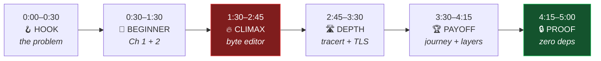

# 06 · The 5-Minute Demo

> **The demo is the product for a judge.** They will spend 5 minutes with you and
> maybe 5 more with the repo. Every second here is worth more than an hour of code.

---

## 🎬 Structure



**Rule: never explain a feature. Always show a person learning something.**

---

## 🪝 0:00 – 0:30 · The Hook

**On screen:** a wall of OSI-layer textbook diagram → cut to our app.

> "Har CS student ne networking padhi hai. Bahut kam ne networking *dekhi* hai.
>
> Packets real hote hain — par koi unhe kabhi dekhta nahi. Aur libraries jaise `fetch`
> sab kuch ek line me chhupa deti hain.
>
> Ye `netlens` hai. Ek networking course jahan har lesson ek **asli packet** se chalta hai —
> jise tum khol sakte ho, badal sakte ho, tod sakte ho.
>
> Zero dependencies. Ek bhi npm package nahi."

**Do NOT say:** "Hi, my name is..., today I will be presenting..." ❌ You just burned 15 seconds.

---

## 🌱 0:30 – 1:30 · The Beginner Path

### Chapter 1 — "You have an address" (0:30–0:55)

```
$ ifconfig
```
Canvas draws **their actual LAN** from the real ARP table.

> "Chapter 1. Teen line, phir kaam.
>
> Ye mera asli IP hai. Ye mera asli router hai. Aur ye — ye kisi aur ka phone hai jo isi
> Wi-Fi pe hai. Mere computer ko pehle se pata tha. **Ye simulation nahi hai — ye mera
> ghar ka network hai.**"

### Chapter 2 — "Names become numbers" (0:55–1:30)

```
$ dig facebook.com
```
Packet flies across the canvas to 1.1.1.1 and back. Narration under it.

> "Chapter 2. DNS. Beginner ke liye bas itna: naam do, number milta hai.
>
> Aur ye animation nahi hai — 28 bytes abhi mere laptop se 1.1.1.1 pe gaye.
> 13 millisecond me jawab aaya."

> ⚠️ **Use `facebook.com`, NOT `github.com`.** Verified: github.com has **no AAAA
> record at all**, so the IPv6 edit below produces nothing. See
> [07-PREFLIGHT-RESULTS](07-PREFLIGHT-RESULTS.md#-block-2-corrections).

**Then click Tier 3.**

> "Ab jo student ko header-level detail chahiye — wo yahan zoom karta hai."

Field tree opens. Click `QTYPE` → hex highlights bytes 28–29 → bit ruler shows the bits.

> "Ek hi data, chaar depth levels. Beginner Tier 2 pe ruk jaata hai. Student yahan aata hai."

---

## 🔥 1:30 – 2:45 · THE CLIMAX — Break a real packet

> **This is the moment. Slow down. Do not rush it. Rehearse it 5 times.**

### Edit 1 — QTYPE (1:30–2:05)

> "Ye byte QTYPE hai. Abhi `01` hai — matlab 'mujhe IPv4 address do'.
>
> Main ise `1c` kar deta hoon. `1c` matlab AAAA — IPv6.
>
> Aur ab main ye edited packet **wapas asli DNS server ko bhejta hoon.**"

Press `[r]`. Packet flies. Response comes back — **verified real output:**

```
facebook.com.   60   IN   AAAA   2a03:2880:f312:1:face:b00c:0:25de
                                                  ^^^^^^^^^
```

> 🥚 **Point at `face:b00c`.** Facebook literally spelled "facebook" in hex inside
> their IPv6 address. It is a real easter egg, it is on screen, and it proves
> beyond any doubt that this is live data and not a mock.

**Pause. Two full seconds of silence.**

> "Maine ek byte badla. Internet ne alag jawab diya.
>
> **Ye fake karna impossible hai.**"

### Edit 2 — Break the Transaction ID (2:05–2:25)

> "Ab kuch todte hain. Ye Transaction ID hai — request aur response ko match karta hai.
> Tumhara computer 0x1a2b ka intezaar kar raha hai. Main packet me 0x7f3e likh deta hoon."

Change it. Re-send. **Verified real output:**

```
⚠️  DNS response · REJECTED — transaction id mismatch
    waiting for 0x1a2b, reply carried 0x7f3e
```

> "Server ne jawab bheja. Humne reject kar diya. **Ye anti-spoofing hai** — koi bhi
> attacker fake DNS reply nahi bhej sakta kyunki wo ye random ID guess nahi kar sakta.
>
> Ye kisi textbook ki line nahi hai. Ye maine abhi tod ke dekha."

### Edit 3 — SNI (2:25–2:45)

```
$ tls github.com
```

> "Ab TLS. Ye SNI extension hai — handshake ka **ekmatra hissa jo encrypted nahi hota**.
> Isse server ko pata chalta hai ki konsi site chahiye.
>
> Main Medium ke server se connected hoon. IP wahi rahega. Main sirf SNI me likh deta hoon —
> `discord.com`."

Re-send. **A completely different company's certificate comes back.**

```
  Subject   CN = discord.com
  Issuer    Cloudflare TLS Issuing ECC CA 3
```

**Pause. Let it land.**

> "IP nahi badla. Server nahi badla. Maine ek naam badla — aur Medium ke server ne mujhe
> **Discord ka certificate** de diya.
>
> Ek IP, hazaaron websites. SNI hi wo naam hai.
>
> Aur kyunki ye encrypted nahi hota — tumhara ISP aaj bhi dekh sakta hai tum konsi site
> khol rahe ho, chahe HTTPS ho."

---

## 🛣️ 2:45 – 3:30 · Depth

### Live traceroute (2:45–3:10)

```
$ tracert github.com
```

Routers appear on the canvas one by one over SSE. Link length ∝ latency.

> "Chapter 3. Tumhara packet raasta nahi jaanta. Har router sirf **agla** step jaanta hai.
>
> Ye asli hops hain, live aa rahe hain. Mera router... mera ISP... Mumbai exchange...
>
> Aur ye jo yahan latency 18ms se 140ms jump hui — **wo samundar ke neeche wali cable hai.**"

### TLS certificate (3:10–3:30)

> "Chapter 5. Ye certificate humne khud parse kiya — apna ASN.1/DER parser likh ke.
> `node-forge` nahi, `x509` nahi. Subject, issuer, validity, SANs — sab humne nikale.
>
> 163 din baaki hain expire hone me."

---

## 🏆 3:30 – 4:15 · The Payoff

### Chapter 7 — The full journey (3:30–4:00)

```
$ journey https://github.com
```

One continuous animation, every protocol firing in order.

> "Chapter 7. Sab kuch ek saath.
>
> DNS... routing... TCP connect... TLS handshake... HTTP request... response.
>
> **95 milliseconds. 4 protocols. 6 round trips.**
>
> Tumne ye aaj das hazaar baar kiya. Ye raha, byte by byte, actually kya hua."

Point at the cost breakdown bar.

> "Aur dekho — page load ka **ek tihai hissa TLS handshake hai.** Isiliye keep-alive
> exist karta hai. Isiliye HTTP/2 bana. Ab pata chala kyun."

### Chapter 8 — The reveal (4:00–4:15)

> "Aur ab — Chapter 8."

Peel animation runs on a real captured packet.

> "Ye sab jo tumne seekha, wo **layers me organized tha.**
>
> Ethernet. IP. TCP. TLS. HTTP. Yahi OSI model hai.
>
> Har course isse **Chapter 1** me padhata hai — saat bekaar naam, bina kisi context ke.
> Hum ise **Chapter 8** me padhate hain, jab tumhe har piece pehle se pata ho.
>
> **Yahi wo jagah hai jahan beginners quit karte hain. Humne wo order ulta kar diya.**"

---

## 🔒 4:15 – 5:00 · The Proof

### Zero-dependency verification (4:15–4:40)

```
$ cat package.json | grep -A2 dependencies
  "dependencies": {},
  "devDependencies": {},

$ ls node_modules
  ls: node_modules: No such file or directory

$ node verify-zero-dep.js

  files scanned .......... 47
  imports found .......... 132
    ├─ relative .......... 118  ✅
    ├─ node: builtins ....  14  ✅
    └─ third-party ....... 000  ✅

  🏆 ZERO DEPENDENCY VERIFIED
```

> "Zero dependencies. Aur hum sirf claim nahi karte — hum **verify** karte hain.
> Ye script har import scan karti hai, HTML aur CSS bhi. Ek bhi third-party mila to build fail.
>
> Aur hum sirf packages avoid nahi kiye — humne unka **kaam** kiya:
> DNS wire codec, ASN.1 certificate parser, HTTP/1.1 chunked parser, terminal emulator,
> tween engine, aur apna bundler. **Lagbhag 35 npm packages — 700 million weekly downloads.**"

### The offline mic drop (4:40–4:50)

**Turn off Wi-Fi on camera.**

```
$ npm test
  ✔ 43 tests passed
```

> "Internet band. Tests abhi bhi pass. Kyunki har test **asli capture kiye hue packets**
> pe chalta hai — live network pe nahi. Deterministic, offline, fast."

### Close (4:50–5:00)

```
$ node run.js
```

> "Ek command. Ek file build. Zero dependencies.
>
> **Networking padhne ki cheez nahi hai. Todne ki cheez hai.**"

---

## 🎥 Production checklist

| ✅ | Item |
|---|---|
| ☐ | **Record backup clips of every wow-moment the day it first works** — do not rely on the live take |
| ☐ | Rehearse the byte-editor sequence **5 times** — exact keystrokes, no typos on camera |
| ☐ | ~~Mobile hotspot~~ — ✅ home network verified clear ([pre-flight](07-PREFLIGHT-RESULTS.md)). Still carry it as backup for a venue demo. |
| ☐ | Use `medium.com` for the SNI swap — **NOT github.com** (dedicated IP, nothing happens) |
| ☐ | Warm the DNS/route caches before recording so timings look fast |
| ☐ | Font size **18pt+** — judges may watch on a laptop or phone |
| ☐ | Dark theme (hex + terminal read better, looks like a real tool) |
| ☐ | **No music.** Voice only. Music makes technical demos harder to follow. |
| ☐ | Captions on the 4 key numbers: `28 bytes` · `12.4 ms` · `95.4 ms` · `0 dependencies` |
| ☐ | Test the uploaded link in an **incognito window** before submitting |
| ☐ | Keep it **under 5:00**. 4:45 is better than 5:15. |

---

## ⏱️ Time budget (memorise)

| Segment | Time | Cumulative |
|---|:--:|:--:|
| Hook | 0:30 | 0:30 |
| Beginner path (Ch 1, 2) | 1:00 | 1:30 |
| 🔥 **Byte editor climax** | **1:15** | 2:45 |
| Depth (tracert, TLS) | 0:45 | 3:30 |
| Payoff (Ch 7, 8) | 0:45 | 4:15 |
| Zero-dep proof | 0:35 | 4:50 |
| Close | 0:10 | 5:00 |

> **25% of the entire video is the byte editor.** That is correct and intentional.
> It is the one thing no other submission will have.

---

## 🗣️ Lines to reuse in the README

- *"An animation can't do this. We changed one byte and the internet answered differently."*
- *"Every course teaches OSI in Chapter 1. That's where beginners quit. We teach it in Chapter 8 — as the reveal."*
- *"Turn off your Wi-Fi. The tests still pass."*
- *"We didn't avoid the packages. We did their job."*
- *"Networking isn't something to read. It's something to break."*

---

## ❌ Demo anti-patterns

| Don't | Why |
|---|---|
| Show the code | Judges read the repo. The video is for the *experience*. |
| Explain the architecture | That's what `docs/01` is for. |
| Say "as you can see" | Show it instead. |
| Apologise for missing features | Never. Show what exists, confidently. |
| Live-type long URLs | Pre-fill or use short domains. Typos on camera kill momentum. |
| Rush the byte editor | It's the whole demo. Give it 75 seconds. |

---

**⬅️ Back to:** [docs/README.md](README.md)
