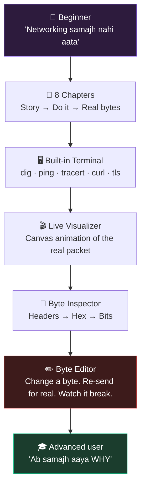

# 🔍 netlens — Docs Index

> **`netlens`** — *"A lens for the network. See every byte."*
> Name locked. See [00-OVERVIEW](00-OVERVIEW.md) for the pitch.

**Zero Dependency | 72-Hour Hackathon** · Solo build · Node.js 22 + Browser · **0 npm packages**

---

## 🗺️ Read in this order

| # | Doc | What's inside | Read when |
|---|-----|---------------|-----------|
| 0 | [**00-OVERVIEW.md**](00-OVERVIEW.md) | Problem, user, USP, what we are NOT building | First. Always. |
| 1 | [**01-ARCHITECTURE.md**](01-ARCHITECTURE.md) | System diagram, data flow, module boundaries | Before writing any code |
| 2 | [**02-FILE-STRUCTURE.md**](02-FILE-STRUCTURE.md) | Every folder + every file, and its one job | While scaffolding |
| 3 | [**03-CHAPTERS.md**](03-CHAPTERS.md) | All 8 lessons, tier by tier, with challenges | While building lessons |
| 4 | [**04-72-HOUR-PLAN.md**](04-72-HOUR-PLAN.md) | Hour-by-hour schedule + cut lines | Every morning |
| 5 | [**05-ZERO-DEP-STRATEGY.md**](05-ZERO-DEP-STRATEGY.md) | Package killers, STDLIB log, proof artifacts | Day 3 (and while coding) |
| 6 | [**06-DEMO-SCRIPT.md**](06-DEMO-SCRIPT.md) | The 5-minute video, second by second | Day 3 |
| 7 | [**07-PREFLIGHT-RESULTS.md**](07-PREFLIGHT-RESULTS.md) | ✅ Verified network capabilities + corrections found while building | **Done — read it** |
| 8 | [**08-PROJECT-STATE.md**](08-PROJECT-STATE.md) | 📍 **Where we actually are** — blocks done, settled decisions, verified demo hosts, bugs found | **First, when resuming** |

---

## ⚡ The whole project in one picture

---

## 🎯 The one-line pitch

> **A networking course where every lesson is powered by a real packet you can open, edit, break, and re-send — built with zero dependencies.**

---

## 🏆 Bonus targets

| Bonus | Points | Status | How |
|---|---|---|---|
| Single File | +5 | 🎯 Planned | `node build.js` → `dist/netlens.js` |
| Reproducible Build | +5 | 🎯 Planned | Byte-identical output, hash committed |
| Package Killer | +3 | 🎯 Planned | 12+ npm packages replaced ([see list](05-ZERO-DEP-STRATEGY.md)) |
| STDLIB Log | +3 | 🎯 Planned | `STDLIB.md` written *as we build*, not after |

**Base total target: 100% + 16 bonus.**

---

## 🚦 Golden rules (non-negotiable)

1. **3 lines of text max, then the user must DO something.** No theory walls.
2. **Real > Simulated.** If it can be real, it is real. If it can't, we label it `SIM`.
3. **Zoom levels = difficulty levels.** Beginner never leaves Tier 1. Same data, deeper view.
4. **Layers (OSI) come LAST**, not first. That's why beginners quit everywhere else.
5. **If a feature is not in the 5-min demo, it does not get built on Day 3.**
